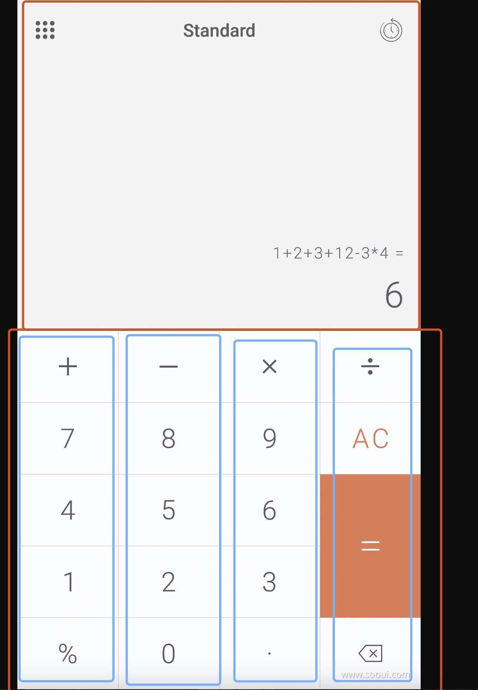

# computer_application_1

标准计算器

```
功能：
  --  历史记录
  --  主题转换
  --  显示区域 分为表达式 和 结果
```

## Getting Started

```
  -- lib
     --- weight 
         --- animation_button.dart // 动画按钮组件
     --- main.dart // 入口文件
     --- calculatorApp // app 应用界面
     --- cal.dart // 内部处理用户按键逻辑 计算逻辑
     --- calculator_history // 记录用户历史表达式的逻辑
  -- fontIcon
    -- ....  这下面是一些按图标文件
```

## 编写页面布局

大概的整体布局，上下层： 上层为显示区域， 下称为操作区域

